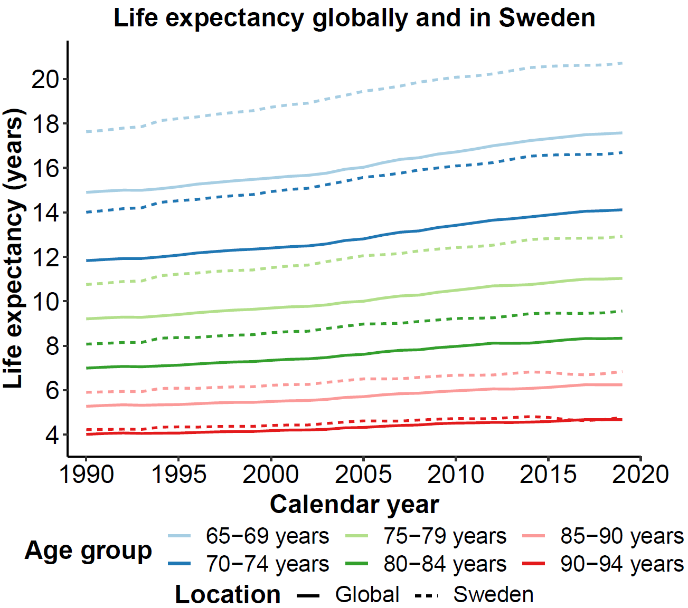

```{css, echo = FALSE}
body {
position: relative;
left: -350px;
width: 1800px
}

h1 {
text-indent: 0;
margin: 0px;
padding: -1;
border: 0px;
width: 1200px;
}


h3 {
text-indent: 0;
margin: 0px;
padding: -1;
border: 0px;
width: 1200px;
}

d-article h3 {
    margin-top: 0.3rem;
    margin-bottom: 0em;
}

ul {
text-indent: 0;
margin: 0px;
padding: -1;
border: 0px;
width: 1200px;
}

p {
text-indent: 0;
padding: -1;
border: 0px;
width: 1200px;
margin-top: 1rem;
}

d-article li {
    margin-top: 0em;
    margin-bottom: 0em;
    margin-left: 0;
    padding-left: 0;
}

d-article p, d-article ul, d-article ol, d-article blockquote {
    margin-top: 1;
    margin-bottom: 0em;
    margin-left: 0;
    margin-right: 0;
}

```





<div style="display: flex; justify-content: space-between;">
  
  
</div>

<div style="display: flex; justify-content: space-between;">
  
  
</div>


**Reference:**<br>
GBD Results tool: Use the following to cite data included in this download: Global Burden of Disease Collaborative Network. Global Burden of Disease Study 2019 (GBD 2019) Results. Seattle, United States: Institute for Health Metrics and Evaluation (IHME), 2020. Available from https://vizhub.healthdata.org/gbd-results/.


